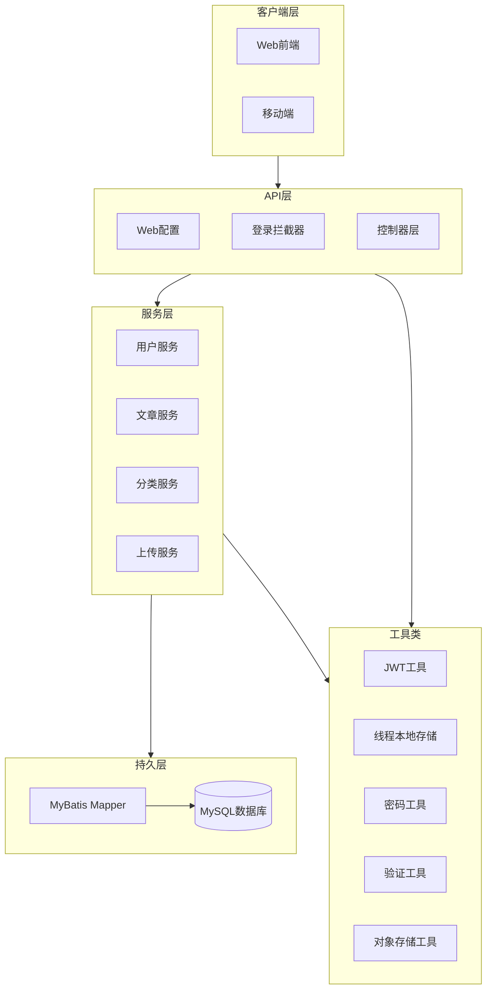
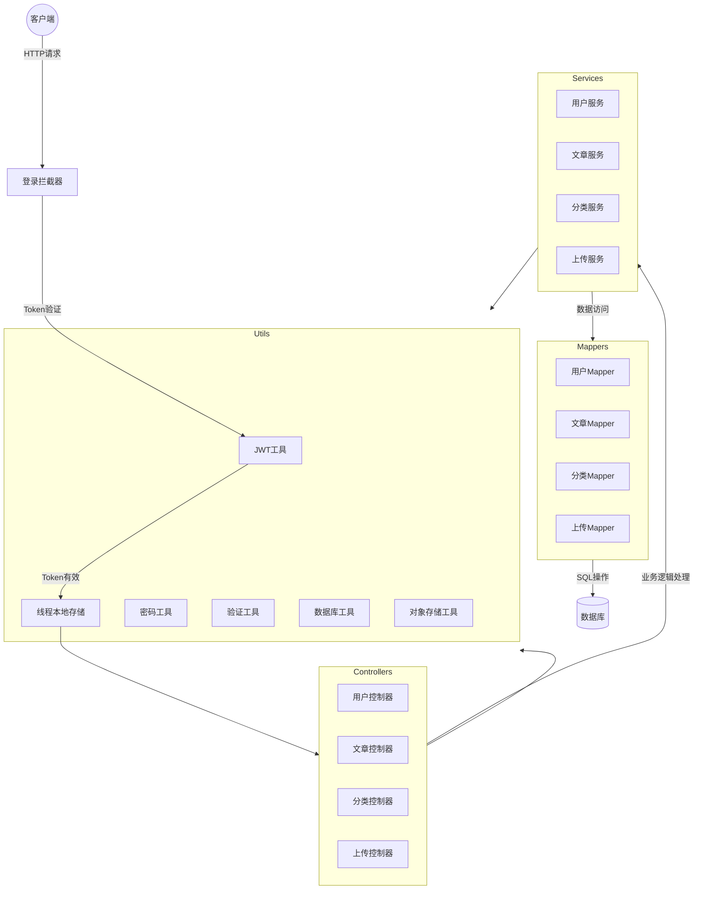
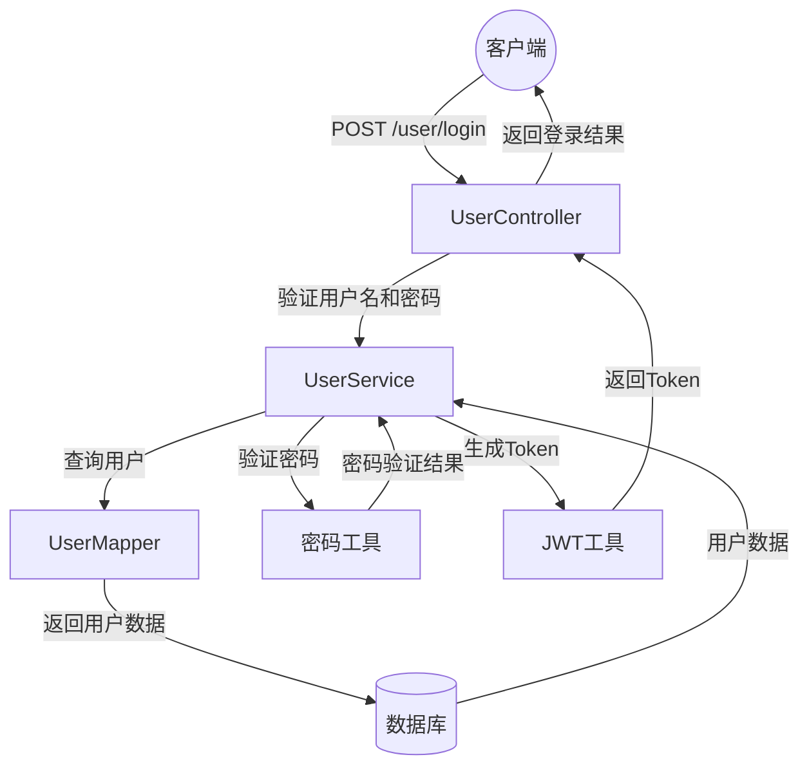
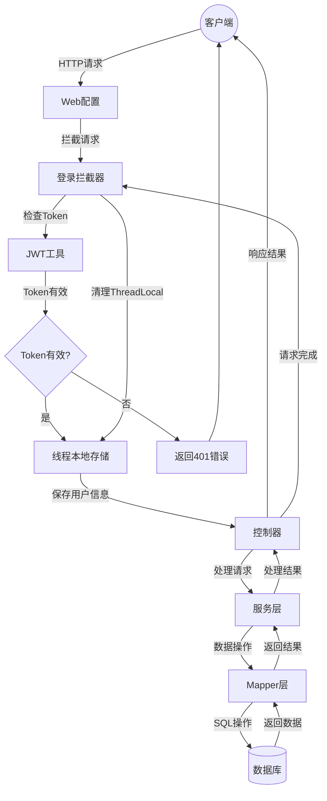
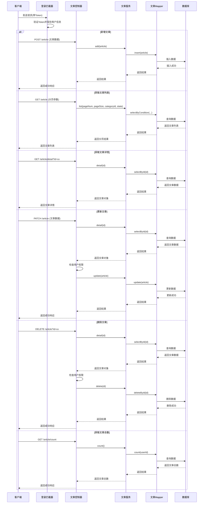

## 系统架构

```mermaid
flowchart TD
    subgraph Client[客户端层]
        Web[Web前端]
        Mobile[移动端]
    end
    
    subgraph API[API层]
        direction TB
        WebConfig[Web配置]
        LoginInterceptor[登录拦截器]
        Controllers[控制器层]
    end
    
    subgraph Service[服务层]
        UserService[用户服务]
        ArticleService[文章服务]
        CategoryService[分类服务]
        UploadService[上传服务]
    end
    
    subgraph Persistence[持久层]
        Mappers[MyBatis Mapper]
        DB[(MySQL数据库)]
    end
    
    subgraph Utils[工具类]
        JWTUtil[JWT工具]
        ThreadLocalUtil[线程本地存储]
        PasswordUtil[密码工具]
        ValidationUtil[验证工具]
        ObjectStorageUtil[对象存储工具]
    end
    
    Client --> API
    API --> Service
    Service --> Persistence
    Service --> Utils
    API --> Utils
    Mappers --> DB
```

## 项目流程图

```mermaid
flowchart TD
    Client((客户端)) --> |HTTP请求| LoginInterceptor[登录拦截器]
    
    LoginInterceptor --> |Token验证| JWTUtil[JWT工具]
    JWTUtil --> |Token有效| ThreadLocalUtil[线程本地存储]
    ThreadLocalUtil --> Controllers
    
    subgraph Controllers
        UserController[用户控制器]
        ArticleController[文章控制器]
        CategoryController[分类控制器]
        UploadController[上传控制器]
    end
    
    Controllers --> |业务逻辑处理| Services
    
    subgraph Services
        UserService[用户服务]
        ArticleService[文章服务]
        CategoryService[分类服务] 
        UploadService[上传服务]
    end
    
    Services --> |数据访问| Mappers
    
    subgraph Mappers
        UserMapper[用户Mapper]
        ArticleMapper[文章Mapper]
        CategoryMapper[分类Mapper]
        UploadMapper[上传Mapper]
    end
    
    Mappers --> |SQL操作| Database[(数据库)]
    
    subgraph Utils
        JWTUtil[JWT工具]
        ThreadLocalUtil[线程本地存储]
        PasswordUtil[密码工具]
        ValidationUtil[验证工具]
        DatabaseUtil[数据库工具]
        ObjectStorageUtil[对象存储工具]
    end
    
    Services --> Utils
    Controllers --> Utils
```

## 用户登录流程图

```mermaid
flowchart TD
    Client((客户端)) --> |POST /user/login| UserController
    UserController --> |验证用户名和密码| UserService
    UserService --> |查询用户| UserMapper
    UserMapper --> |返回用户数据| Database[(数据库)]
    Database --> |用户数据| UserService
    UserService --> |验证密码| PasswordUtil[密码工具]
    PasswordUtil --> |密码验证结果| UserService
    UserService --> |生成Token| JWTUtil[JWT工具]
    JWTUtil --> |返回Token| UserController
    UserController --> |返回登录结果| Client
```

## 请求拦截流程图

```mermaid
flowchart TD
    Client((客户端)) -->|HTTP请求| WebConfig[Web配置]
    WebConfig -->|拦截请求| LoginInterceptor[登录拦截器]
    LoginInterceptor -->|检查Token| JWTUtil[JWT工具]
    
    JWTUtil -->|Token有效| ValidToken{Token有效?}
    ValidToken -->|是| ThreadLocalUtil[线程本地存储]
    ThreadLocalUtil -->|保存用户信息| Controller[控制器]
    
    ValidToken -->|否| Error[返回401错误]
    Error --> Client
    
    Controller -->|处理请求| Service[服务层]
    Service -->|数据操作| Mapper[Mapper层]
    Mapper -->|SQL操作| Database[(数据库)]
    
    Database -->|返回数据| Mapper
    Mapper -->|返回结果| Service
    Service -->|处理结果| Controller
    Controller -->|响应结果| Client
    
    Controller -->|请求完成| LoginInterceptor
    LoginInterceptor -->|清理ThreadLocal| ThreadLocalUtil
```

## 时序图

### 文章管理

```mermaid
sequenceDiagram
    participant Client as 客户端
    participant Interceptor as 登录拦截器
    participant ArticleController as 文章控制器
    participant ArticleService as 文章服务
    participant ArticleMapper as 文章Mapper
    participant DB as 数据库
    
    Client->>Interceptor: 发送请求(带Token)
    Interceptor->>Interceptor: 验证Token并保存用户信息
    
    alt 新增文章
        Client->>ArticleController: POST /article (文章数据)
        ArticleController->>ArticleService: add(article)
        ArticleService->>ArticleMapper: insert(article)
        ArticleMapper->>DB: 插入数据
        DB-->>ArticleMapper: 插入成功
        ArticleMapper-->>ArticleService: 返回结果
        ArticleService-->>ArticleController: 返回结果
        ArticleController-->>Client: 返回成功响应
    
    else 获取文章列表
        Client->>ArticleController: GET /article (分页参数)
        ArticleController->>ArticleService: list(pageNum, pageSize, categoryId, state)
        ArticleService->>ArticleMapper: selectByCondition(...)
        ArticleMapper->>DB: 查询数据
        DB-->>ArticleMapper: 返回文章列表
        ArticleMapper-->>ArticleService: 返回结果
        ArticleService-->>ArticleController: 返回分页结果
        ArticleController-->>Client: 返回文章列表
    
    else 获取文章详情
        Client->>ArticleController: GET /article/detail?id=xx
        ArticleController->>ArticleService: detail(id)
        ArticleService->>ArticleMapper: selectById(id)
        ArticleMapper->>DB: 查询数据
        DB-->>ArticleMapper: 返回文章数据
        ArticleMapper-->>ArticleService: 返回结果
        ArticleService-->>ArticleController: 返回文章对象
        ArticleController-->>Client: 返回文章详情
    
    else 更新文章
        Client->>ArticleController: PATCH /article (文章数据)
        ArticleController->>ArticleService: detail(id)
        ArticleService->>ArticleMapper: selectById(id)
        ArticleMapper->>DB: 查询数据
        DB-->>ArticleMapper: 返回文章数据
        ArticleMapper-->>ArticleService: 返回结果
        ArticleService-->>ArticleController: 返回文章对象
        ArticleController->>ArticleController: 检查用户权限
        ArticleController->>ArticleService: update(article)
        ArticleService->>ArticleMapper: update(article)
        ArticleMapper->>DB: 更新数据
        DB-->>ArticleMapper: 更新成功
        ArticleMapper-->>ArticleService: 返回结果
        ArticleService-->>ArticleController: 返回结果
        ArticleController-->>Client: 返回成功响应
    
    else 删除文章
        Client->>ArticleController: DELETE /article?id=xx
        ArticleController->>ArticleService: detail(id)
        ArticleService->>ArticleMapper: selectById(id)
        ArticleMapper->>DB: 查询数据
        DB-->>ArticleMapper: 返回文章数据
        ArticleMapper-->>ArticleService: 返回结果
        ArticleService-->>ArticleController: 返回文章对象
        ArticleController->>ArticleController: 检查用户权限
        ArticleController->>ArticleService: delete(id)
        ArticleService->>ArticleMapper: deleteById(id)
        ArticleMapper->>DB: 删除数据
        DB-->>ArticleMapper: 删除成功
        ArticleMapper-->>ArticleService: 返回结果
        ArticleService-->>ArticleController: 返回结果
        ArticleController-->>Client: 返回成功响应
        
    else 获取文章总数
        Client->>ArticleController: GET /article/count
        ArticleController->>ArticleService: count()
        ArticleService->>ArticleMapper: count(userId)
        ArticleMapper->>DB: 查询数据
        DB-->>ArticleMapper: 返回文章总数
        ArticleMapper-->>ArticleService: 返回结果
        ArticleService-->>ArticleController: 返回文章总数
        ArticleController-->>Client: 返回成功响应
    end
```

### 用户管理

```mermaid
sequenceDiagram
    participant Client as 客户端
    participant UserController as 用户控制器
    participant UserService as 用户服务
    participant UserMapper as 用户Mapper
    participant Utils as 工具类
    participant DB as 数据库
    
    alt 用户注册
        Client->>UserController: POST /user/register
        UserController->>Utils: validationUtil.register()
        Utils-->>UserController: 验证结果
        UserController->>UserService: register(username, password, nickname)
        UserService->>Utils: passwordUtil.SHA256Encrypt(password)
        Utils-->>UserService: 加密后的密码
        UserService->>UserMapper: register(username, encryptedPassword, nickname)
        UserMapper->>DB: 插入用户数据
        DB-->>UserMapper: 插入成功
        UserMapper-->>UserService: 返回结果
        UserService-->>UserController: 返回结果
        UserController-->>Client: 返回成功响应
    
    else 用户登录
        Client->>UserController: POST /user/login
        UserController->>UserService: findByUsername(username)
        UserService->>UserMapper: findByName(username)
        UserMapper->>DB: 查询用户
        DB-->>UserMapper: 返回用户数据
        UserMapper-->>UserService: 返回用户
        UserService-->>UserController: 返回用户
        UserController->>Utils: passwordUtil.SHA256Encrypt(password)
        Utils-->>UserController: 加密后的密码
        UserController->>UserController: 比较密码
        UserController->>Utils: jwtHelper.genToken(claims)
        Utils-->>UserController: JWT令牌
        UserController-->>Client: 返回Token
    
    else 获取用户信息
        Client->>UserController: GET /user/getInfo
        UserController->>Utils: ThreadLocalUtil.get()
        Utils-->>UserController: 当前用户信息
        UserController->>UserService: findByUsername(username)
        UserService->>UserMapper: findByName(username)
        UserMapper->>DB: 查询用户
        DB-->>UserMapper: 返回用户数据
        UserMapper-->>UserService: 返回用户
        UserService-->>UserController: 返回用户
        UserController-->>Client: 返回用户信息
    
    else 更新基本信息
        Client->>UserController: PUT /user/updateBasic
        UserController->>Utils: ThreadLocalUtil.get()
        Utils-->>UserController: 当前用户信息
        UserController->>UserController: 验证ID一致性
        UserController->>Utils: validationUtil.updateBasic()
        Utils-->>UserController: 验证结果
        UserController->>UserService: updateBasic(user)
        UserService->>UserMapper: updateBasic(user)
        UserMapper->>DB: 更新用户数据
        DB-->>UserMapper: 更新成功
        UserMapper-->>UserService: 返回结果
        UserService-->>UserController: 返回结果
        UserController-->>Client: 返回成功响应
    
    else 更新头像
        Client->>UserController: PATCH /user/updatePic
        UserController->>UserService: updatePic(picUrl)
        UserService->>Utils: ThreadLocalUtil.get()
        Utils-->>UserService: 当前用户信息
        UserService->>UserMapper: updatePic(id, picUrl)
        UserMapper->>DB: 更新头像
        DB-->>UserMapper: 更新成功
        UserMapper-->>UserService: 返回结果
        UserService-->>UserController: 返回结果
        UserController-->>Client: 返回成功响应
    
    else 更新密码
        Client->>UserController: PATCH /user/updatePwd
        UserController->>UserController: 验证参数
        UserController->>Utils: ThreadLocalUtil.get()
        Utils-->>UserController: 当前用户信息
        UserController->>UserService: findByUsername(username)
        UserService->>UserMapper: findByName(username)
        UserMapper->>DB: 查询用户
        DB-->>UserMapper: 返回用户数据
        UserMapper-->>UserService: 返回用户
        UserService-->>UserController: 返回用户
        UserController->>Utils: passwordUtil.SHA256Encrypt(oldPwd)
        Utils-->>UserController: 加密旧密码
        UserController->>UserController: 验证密码匹配
        UserController->>Utils: validationUtil.passwordValid(newPwd)
        Utils-->>UserController: 验证结果
        UserController->>UserService: updatePwd(newPwd)
        UserService->>Utils: ThreadLocalUtil.get()
        Utils-->>UserService: 当前用户信息
        UserService->>Utils: passwordUtil.SHA256Encrypt(newPwd)
        Utils-->>UserService: 加密新密码
        UserService->>UserMapper: updatePwd(id, encryptedPwd)
        UserMapper->>DB: 更新密码
        DB-->>UserMapper: 更新成功
        UserMapper-->>UserService: 返回结果
        UserService-->>UserController: 返回结果
        UserController-->>Client: 返回成功响应
    end
```

### 分类管理

```mermaid
sequenceDiagram
    participant Client as 客户端
    participant Interceptor as 登录拦截器
    participant CategoryController as 分类控制器
    participant CategoryService as 分类服务
    participant CategoryMapper as 分类Mapper
    participant DB as 数据库
    
    Client->>Interceptor: 发送请求(带Token)
    Interceptor->>Interceptor: 验证Token并保存用户信息
    
    alt 新增分类
        Client->>CategoryController: POST /category (分类数据)
        CategoryController->>CategoryService: add(category)
        CategoryService->>CategoryMapper: insert(category)
        CategoryMapper->>DB: 插入数据
        DB-->>CategoryMapper: 插入成功
        CategoryMapper-->>CategoryService: 返回结果
        CategoryService-->>CategoryController: 返回结果
        CategoryController-->>Client: 返回成功响应
    
    else 获取分类列表
        Client->>CategoryController: GET /category
        CategoryController->>CategoryService: list()
        CategoryService->>CategoryMapper: selectAll()
        CategoryMapper->>DB: 查询数据
        DB-->>CategoryMapper: 返回分类列表
        CategoryMapper-->>CategoryService: 返回结果
        CategoryService-->>CategoryController: 返回分类列表
        CategoryController-->>Client: 返回分类列表
    
    else 获取分类详情
        Client->>CategoryController: GET /category/detail?id=xx
        CategoryController->>CategoryService: detail(id)
        CategoryService->>CategoryMapper: selectById(id)
        CategoryMapper->>DB: 查询数据
        DB-->>CategoryMapper: 返回分类数据
        CategoryMapper-->>CategoryService: 返回结果
        CategoryService-->>CategoryController: 返回分类对象
        CategoryController->>CategoryController: 检查用户权限
        CategoryController-->>Client: 返回分类详情
    
    else 更新分类
        Client->>CategoryController: PUT /category (分类数据)
        CategoryController->>CategoryService: detail(id)
        CategoryService->>CategoryMapper: selectById(id)
        CategoryMapper->>DB: 查询数据
        DB-->>CategoryMapper: 返回分类数据
        CategoryMapper-->>CategoryService: 返回结果
        CategoryService-->>CategoryController: 返回分类对象
        CategoryController->>CategoryController: 检查用户权限
        CategoryController->>CategoryService: update(category)
        CategoryService->>CategoryMapper: update(category)
        CategoryMapper->>DB: 更新数据
        DB-->>CategoryMapper: 更新成功
        CategoryMapper-->>CategoryService: 返回结果
        CategoryService-->>CategoryController: 返回结果
        CategoryController-->>Client: 返回成功响应
    
    else 删除分类
        Client->>CategoryController: DELETE /category?id=xx
        CategoryController->>CategoryService: detail(id)
        CategoryService->>CategoryMapper: selectById(id)
        CategoryMapper->>DB: 查询数据
        DB-->>CategoryMapper: 返回分类数据
        CategoryMapper-->>CategoryService: 返回结果
        CategoryService-->>CategoryController: 返回分类对象
        CategoryController->>CategoryController: 检查用户权限
        CategoryController->>CategoryService: delete(id)
        CategoryService->>CategoryMapper: deleteById(id)
        CategoryMapper->>DB: 删除数据
        DB-->>CategoryMapper: 删除成功
        CategoryMapper-->>CategoryService: 返回结果
        CategoryService-->>CategoryController: 返回结果
        CategoryController-->>Client: 返回成功响应
        
    else 获取分类总数
        Client->>CategoryController: GET /category/count
        CategoryController->>CategoryService: count()
        CategoryService->>CategoryMapper: count(userId)
        CategoryMapper->>DB: 查询数据
        DB-->>CategoryMapper: 返回分类总数
        CategoryMapper-->>CategoryService: 返回结果
        CategoryService-->>CategoryController: 返回分类总数
        CategoryController-->>Client: 返回成功响应
    end
```
